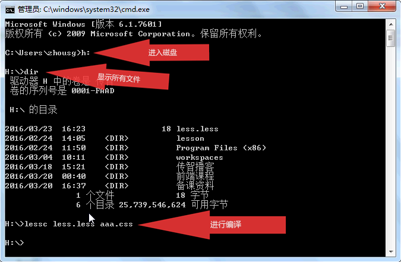

### less
##### 简介
CSS（层叠样式表）是一门历史悠久的标记性语言，同 HTML 一道，被广泛应用于万维网（World Wide Web）中。HTML 主要负责文档结构的定义，CSS 负责文档表现形式或样式的定义。

作为一门标记性语言，CSS 的语法相对简单，对使用者的要求较低，但同时也带来一些问题：CSS 需要书写大量看似没有逻辑的代码，不方便维护及扩展，不利于复用，尤其对于非前端开发工程师来讲，往往会因为缺少 CSS 编写经验而很难写出组织良好且易于维护的 CSS 代码，造成这些困难的很大原因源于 CSS 是一门非程序式语言，没有变量、函数、Scopr（作用域）等概念。Less 为 Web 开发者带来了福音，它在 CSS 的语法基础之上，引入了变量，Mixin（混合），运算以及函数等功能，大大简化了 CSS 的编写，并且降低了 CSS 的维护成本，就像它的名称所说的那样，LESS 可以让我们用更少的代码做更多的事情。

Less 是一门 CSS 预处理语言，它扩充了 CSS 语言，增加了诸如变量、混合（Mixin）、函数等功能，让 CSS 更易维护、方便制作主题、扩充。

Less 可以运行在 Node、浏览器和 Rhino 平台上。网上有很多第三方工具帮助你编译 Less 源码。

##### 原理及使用方式
本质上，Less 包含一套自定义的语法及一个解析器，用户根据这些语法定义自己的样式规则，这些规则最终会通过解析器，编译生成对应的 CSS 文件。Less 并没有裁剪 CSS 原有的特性，更不是用来取代 CSS 的，而是在现有 CSS 语法的基础上，为 CSS 加入程序式语言的特性。

##### 语法
*   变量 
*   Mixin混合
*   嵌套
*   Import
*   函数（内置函数）
---
*   变量
LESS 允许开发者自定义变量，变量可以在全局样式中使用，变量使得样式修改起来更加简单

        /*-----------------变量-----------------*/
        @mainColor:#E93223;
        body{
          color: @mainColor;
        }
    
*   Mixin混合
Mixin（混合）功能对用开发者来说并不陌生，很多动态语言都支持 Mixin（混合）特性，它是多重继承的一种实现，在 Less 中，混合是指在一个 class 中引入另外一个已经定义的 class，就像在当前 class 中增加一个属性一样。

        /*-----------------mixin 混入----------------*/
        /*颜色*/
        .red{
          color: @mainColor;
        }
        .border{
          border: 1px solid #ccc;
        }
        .redBorder(){
          color: @mainColor;
          border: 1px solid #ccc;
        }
        .mixin-class{
          .red();
          .border();
        }
        .mixin-fuc{
          .redBorder();
        }

*   嵌套
在我们书写标准 CSS 的时候，遇到多层的元素嵌套这种情况时，我们要么采用从外到内的选择器嵌套定义，要么采用给特定元素加 class或 ID 的方式

        /*------------------嵌套------------------*/
        #wjs_banner{
          .carousel-inner{
            > div.item{
              a.img_box{
                background: url("../images/slide_01_2000x410.jpg") no-repeat center;
                height: 410px;
                /*调用redBorder mixin*/
                display: block;
                .redBorder();
                /*调用@mainColor 变量*/
                &:hover{
                  color: @mainColor;
                }
              }
              a.img_mobile{
                width: 100%;
                display: block;
                img{
                  width: 100%;
                  display: block;
                }
              }
            }
          }
        }

*   Import 导入
导入其他的Less文件

        /*---------------------Import 引入------------------------*/
        @import "base";
        .f_left{
          float: @right;
        }

*   运算及函数
在我们的 CSS 中充斥着大量的数值型的 value，比如 color、padding、margin 等，这些数值之间在某些情况下是有着一定关系的，那么我们怎样利用 Less 来组织我们这些数值之间的关系呢？

        escape(@string); // 通过 URL-encoding 编码字符串
        e(@string); // 对字符串转义
        %(@string, values...); // 格式化字符串
        unit(@dimension, [@unit: ""]); // 移除或替换属性值的单位
        color(@string); // 将字符串解析为颜色值
        data-uri([mimetype,] url); // * 将资源内嵌到css中，可能回退到url()
        ceil(@number); // 向上取整
        floor(@number); // 向下取整
        percentage(@number); // 将数字转换为百分比，例如 0.5 -> 50%
        round(number, [places: 0]); // 四舍五入取整
        sqrt(number); // * 计算数字的平方根
        abs(number); // * 数字的绝对值
        sin(number); // * sin函数
        asin(number); // * arcsin函数
        cos(number); // * cos函数
        acos(number); // * arccos函数
        tan(number); // * tan函数
        atan(number); // * arctan函数
        pi(); // * 返回PI
        pow(@base, @exponent); // * 返回@base的@exponent次方
        mod(number, number); // * 第一个参数对第二个参数取余
        convert(number, units); // * 在数字之间转换
        unit(number, units); // * 不转换的情况下替换数字的单位
        color(string); // 将字符串或者转义后的值转换成颜色
        rgb(@r, @g, @b); // 转换为颜色值
        rgba(@r, @g, @b, @a); // 转换为颜色值
        argb(@color); // 创建 #AARRGGBB 格式的颜色值
        hsl(@hue, @saturation, @lightness); // 创建颜色值
        hsla(@hue, @saturation, @lightness, @alpha); // 创建颜色值
        hsv(@hue, @saturation, @value); // 创建颜色值
        hsva(@hue, @saturation, @value, @alpha); // 创建颜色值
        hue(@color); // 从颜色值中提取 hue 值（色相）
        saturation(@color); // 从颜色值中提取 saturation 值（饱和度）
        lightness(@color); // 从颜色值中提取 'lightness' 值（亮度）
        hsvhue(@color); // * 从颜色中提取 hue 值，以HSV色彩空间表示（色相）
        hsvsaturation(@color); // * 从颜色中提取 saturation 值，以HSV色彩空间表示（饱和度）
        hsvvalue(@color); // * 从颜色中提取 value 值，以HSV色彩空间表示（色调）
        red(@color); // 从颜色值中提取 'red' 值（红色）
        green(@color); // 从颜色值中提取 'green' 值（绿色）
        blue(@color); // 从颜色值中提取 'blue' 值（蓝色）
        alpha(@color); // 从颜色值中提取 'alpha' 值（透明度）
        luma(@color); // 从颜色值中提取 'luma' 值（亮度的百分比表示法）
        saturate(@color, 10%); // 饱和度增加 10%
        desaturate(@color, 10%); // 饱和度降低 10%
        lighten(@color, 10%); // 亮度增加 10%
        darken(@color, 10%); // 亮度降低 10%
        fadein(@color, 10%); // 透明度增加 10%
        fadeout(@color, 10%); // 透明度降低 10%
        fade(@color, 50%); // 设定透明度为 50%
        spin(@color, 10); // 色相值增加 10
        mix(@color1, @color2, [@weight: 50%]); // 混合两种颜色
        greyscale(@color); // 完全移除饱和度，输出灰色
        contrast(@color1, [@darkcolor: black], [@lightcolor: white], [@threshold: 43%]); 
        // 如果 @color1 的 luma 值 > 43% 输出 @darkcolor，否则输出 @lightcolor
        multiply(@color1, @color2);
        screen(@color1, @color2);
        overlay(@color1, @color2);
        softlight(@color1, @color2);
        hardlight(@color1, @color2);
        difference(@color1, @color2);
        exclusion(@color1, @color2);
        average(@color1, @color2);
        negation(@color1, @color2);
        iscolor(@colorOrAnything); // 判断一个值是否是颜色
        isnumber(@numberOrAnything); // 判断一个值是否是数字（可含单位）
        isstring(@stringOrAnything); // 判断一个值是否是字符串
        iskeyword(@keywordOrAnything); // 判断一个值是否是关键字
        isurl(@urlOrAnything); // 判断一个值是否是url
        ispixel(@pixelOrAnything); // 判断一个值是否是以px为单位的数值
        ispercentage(@percentageOrAnything); // 判断一个值是否是百分数
        isem(@emOrAnything); // 判断一个值是否是以em为单位的数值
        isunit(@numberOrAnything, "rem"); // * 判断一个值是否是指定单位的数值

    [以上来自于LESS中国官网函数手册](http://www.1024i.com/demo/less/reference.html)

*   浏览器使用Less文件
我们可以直接在客户端使用 .less（LESS 源文件），只需要从 [http://lesscss.org](http://lesscss.org)下载 less.js 文件，然后在我们需要引入 LESS 源文件的 HTML 中

        <link rel="stylesheet/less" type="text/css" href="styles.less">
        <link rel="stylesheet/less" type="text/css" href="styles.less">

*   Less编译离线编译
    -   cmd
    -   f:
    -   dir
    -   lessc name.less name.css

    

    更多资料:

    [http://lesscss.org/](http://lesscss.org/)

    [http://www.1024i.com/demo/less/index.html](http://www.1024i.com/demo/less/index.html)

    [http://less.bootcss.com/#](http://less.bootcss.com/#)

    [http://www.ibm.com/developerworks/cn/web/1207_zhaoch_lesscss/](http://www.ibm.com/developerworks/cn/web/1207_zhaoch_lesscss/)

