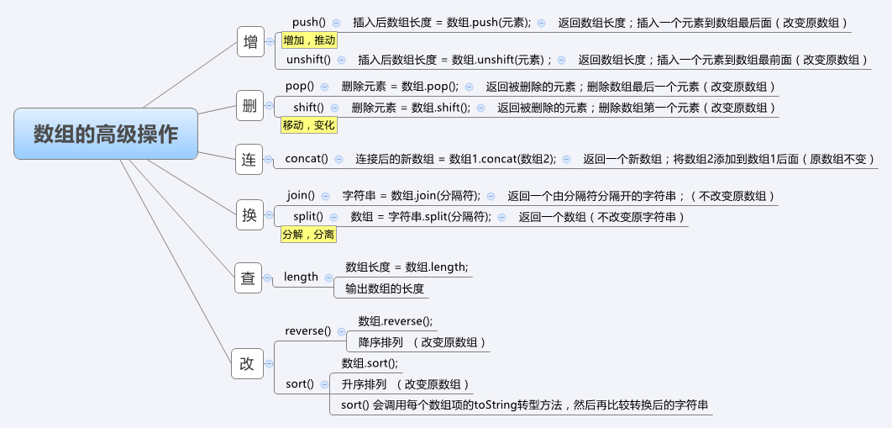

# 数组的操作
### 增

*       push() 
    -   插入后数组长度 = 数组.push(元素);
    -   返回数组长度；插入一个元素到数组最后面（改变原数组）
*       unshift()
    -   插入后数组长度 = 数组.unshift(元素)；
    -   返回数组长度；插入一个元素到数组最前面（改变原数组）

>       var arr = [ 1, 2, 3, 4];
>       var newArrLen1 = arr.push(3);
>       console.log(newArrLen1); // => 5
>       console.log(arr);  // => [ 1, 2, 3, 4, 3]
>       
>       var newArrLen2 = arr.unshift(5);
>       console.log(newArrLen2);  // => 6
>       console.log(arr);  // => [5, 1, 2, 3, 4, 3]

### 删

*      pop()
    -   删除元素 = 数组.pop();
    -   返回被删除的元素；删除数组最后一个元素（改变原数组）
*       shift()
    -   删除元素 = 数组.shift();
    -   返回被删除的元素；删除数组第一个元素（改变原数组）

>       var arr = [1, 2, 3, 4, 5];
>       var char1 = arr.pop();
>       console.log(char1);  // => 5
>       console.log(arr);  // => [1, 2, 3, 4]
>       
>       var char2 = arr.shift();
>       console.log(char2);  // => 1
>       console.log(arr);  // => [2, 3, 4]

### 连

*      concat()
    -   连接后的新数组 = 数组1.concat(数组2);
    -   返回一个新数组；将数组2添加到数组1后面（原数组不变）

>       var arr1 = [1, 2, 3];
>       var arr2 = [6, 7, 8];
>       var newArr = arr1.concat(arr2);
>       console.log(arr1);  // => [1, 2, 3]
>       console.log(arr2);  // => [6, 7, 8]
>       console.log(newArr);  // => [1, 2, 3, 6, 7, 8]

### 换 

*       join()
    -   字符串 = 数组.join(分隔符);
    -   返回一个由分隔符分隔开的字符串；（不改变原数组）

*      split()
    -   数组 = 字符串.split(分隔符);
    -   返回一个数组（不改变原字符串）

>       var arr = [1, 2, 3, 4, 5];
>       var str = arr.join('-');
>       console.log(arr);  // => [1, 2, 3, 4, 5]
>       console.log(str);  // => 1-2-3-4-5
>       
>       var arr1 = str.split('-');
>       console.log(arr1);  // => ["1", "2", "3", "4", "5"]
>       var arr2 = str.split();
>       console.log(arr2);  // => ["1-2-3-4-5"]
>       var arr3 = str.split('');
>       console.log(arr3);  // => ["1", "-", "2", "-", "3", "-", "4", "-", "5"]

### 查

*   length
    -   数组长度 = 数组.length;
    -   输出数组的长度

>       var arr = [1, 2, 3, 4, 5];
>       var arrLen = arr.length;
>       console.log(arr);  // => [1, 2, 3, 4, 5]
>       console.log(arrLen);  // => 5

### 改

*   reverse()
    -   数组.reverse();
    -   降序排列  （改变原数组）

*   sort()
    -   数组.sort();
    -   升序排列  （改变原数组）
    -   sort() 会调用每个数组项的toString转型方法，然后再比较转换后的字符串

>       var arr1 = [1, 9, 3, 10, 50];
>       var newArr1 = arr1.reverse();
>       console.log(arr1);  // => [50, 10, 3, 9, 1]
>       console.log(newArr1);  // => [50, 10, 3, 9, 1]
>       
>       var arr2 = [1, 9, 3, 10, 50];
>       var newArr2 = arr2.sort();
>       console.log(arr2);  // => [1, 10, 3, 50, 9]
>       console.log(newArr2);  // => [1, 10, 3, 50, 9]



### 新增

```javascript
    var arr = [1, 2, 3, 4, 5, 6];
    var arr2 = [1, 2, 3, 4, 5, 6];

    // 增
    console.log(arr, arr.push('haha'));  // => 返回添加后数组的长度  改变原数组
    console.log(arr, arr.unshift('xixi'));
    console.log(arr, arr2, arr.concat(arr2));  // 数组的拼接  不改变原数组

    // 删
    console.log(arr, arr.pop());  // => 返回删除的元素  改变原数组
    console.log([].pop());  // => undefined  当为空数组时返回 undefined
    console.log(arr, arr.shift());

    // 查
    console.log(arr.indexOf(3));  // => 2  返回指定元素在数组中的位置
    console.log(arr.indexOf(7));  // => -1  不存在时  返回 -1

    // 改  splice(index, howmany, element1,....., elementX)
    // index : 必需。规定从何处添加/删除元素。
    // howmany : 必需。规定应该删除多少元素。必须是数字，但可以是 "0"。
                // 如果未规定此参数，则删除从 index 开始到原数组结尾的所有元素。
    // element1 : 可选。可向数组添加的元素

    console.log(arr, arr.splice(4, 1));  // 当为两个参数时  进行移除  返回被移除的元素数组  改变原数组
    console.log(arr2, arr2.slice(2, 3));  // 同 string.slice  不会改变原数组
    console.log(arr, arr.splice(3, 2));  // => [1, 2, 3] [4, 6]
    // 添加  第二个参数为 0 时代表删除 0 个元素，用后面的元素代替
    // 当第一个参数大于数组长度时 会直接在数组之后添加  不会出现 空
    console.log(arr, arr.splice(5, 0, 1, 2, 3));  // => [1, 2, 3, 1, 2, 3] []

    console.log(arr, arr.join());  // 默认按照逗号分隔  不改变原数组

    console.log('ab-djf-sjdkf-jdj'.split('-'));

    // 反转  改变原数组
    console.log(arr, '-----反转-----');
    console.log( arr.reverse());  // 数组的反转

    function fn(a, b){
        return a - b;
    }
    function fn2(a, b){
        return b - a;
    }

    // 排序   改变原数组
    console.log(arr = arr.concat([10, 11, 9]), '-----排序-----');
    console.log(arr.sort());  // 按照 字符编码进行排序  默认情况下 sort 会调用 toString 方法进行比较
    console.log(arr, '-----升序-----');
    console.log(arr.sort(fn));  // 升序  传入一个升序函数即可

    console.log(arr, '-----降序-----');
    console.log(arr.sort(fn2));
```