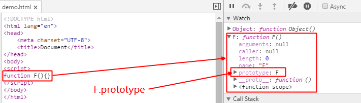
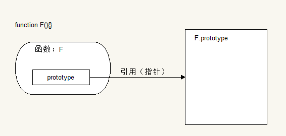
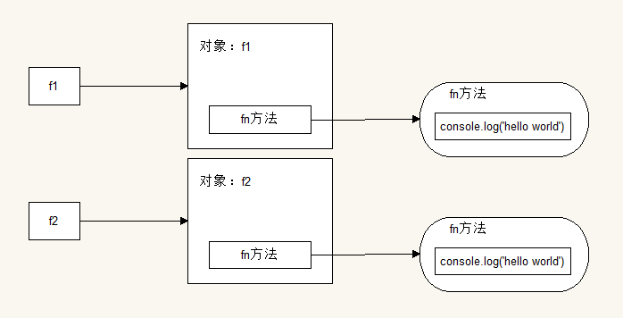
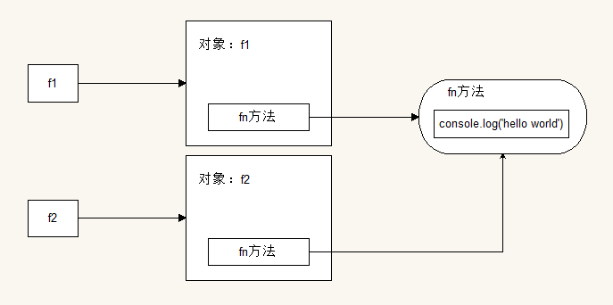
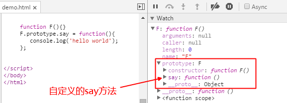
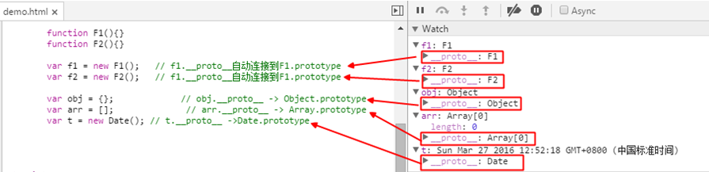
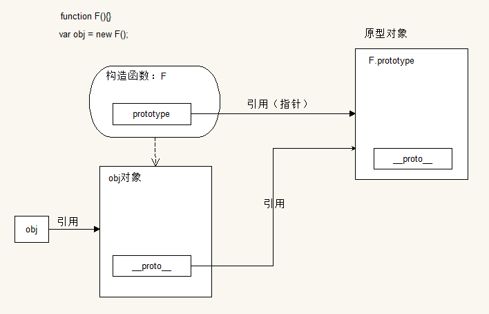
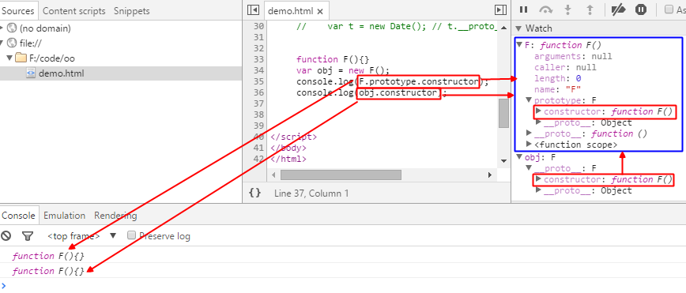
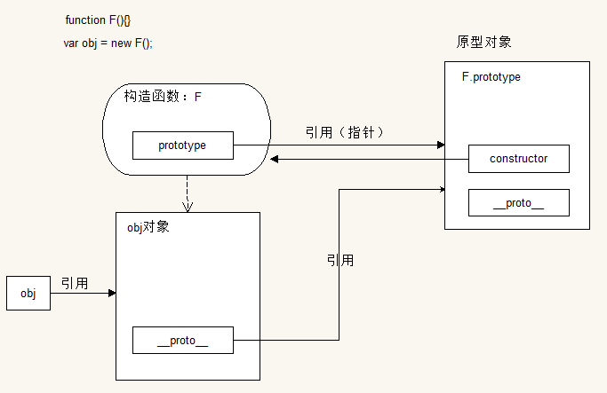

# js中的原型
[TOC]

### 原型属性

*   `prototype`

在js中每当我们创建一个函数的时候就会有一个`prototype`（原型）属性,
这个属性其实是一个引用（指针），指向一个对象，这个对象中有属性和方法
声明一个函数`function F(){}`

其关系结构为：

在js中, 对象` {} `  中包含`toString`  、`valueOf `和`constructor`  等
方法, 实际上就是由原型继承来实现的。对象继承自原型对象`Object.property` 

那么原型又有什么卵用呢？

看一个demo

    // 声明一个构造函数  内部有一个方法fn
    function F(){
        this.fn = function(){
            console.log('hello world');
        };
    }
    // 实例化两个F对象 ： f1和f2
    var f1 = new F();
    var f2 = new F();
    f1.fn();  // => hello world
    f2.fn();  // => hello world
    // 进行比较两个实例对象的fn方法
    console.log(f1.fn === f2.fn);  // => false

通过比较两个实例对象的fn方法可以得出：每个实例对象的fn方法是独立存在的

那么问题就来了？
两个F类型实例有同样功能的方法却占用了两块不同的内存空间
这无疑造成了内存的泄露
因此，就有了`prototype`（原型）的概念

对上面的demo改造一下：

    // 声明一个构造函数  内部有一个方法fn
    function F(){}
    F.prototype.fn = function(){
        console.log('hello world');
    };
    // 实例化两个F对象 ： f1和f2
    var f1 = new F();
    var f2 = new F();
    f1.fn();  // => hello world
    f2.fn();  // => hello world
    // 进行比较两个实例对象的fn方法
    console.log(f1.fn === f2.fn);  // => true

那么`prototype`里面又有什么呢？

`prototype`就是通过调用构造函数（F）创建出来的那个对象（f1和f2）的原型对象
优点：资源共享
说白了就是可以让所有的对象实例共用原型对象里面的所有属性和方法

### 原型对象

*   `__proto__`

在创建函数时，其内部的`prototype`（原型）属性所指向的那个对象就是原型对象
当我们创建一个对象时，其实是存在两个对象：
一个是当前对象（对象本身），一个是原型对象
即每个对象都有一个`__proto__`（原型）属性，指向其原型对象
对象的原型（`__proto__`）就是其构造函数的一个属性（`prototype`）

由某一函数`new`出来的对象，会自动的链接到该函数的`prototype`上

看下面的demo：

具体一点也就是：
通过构造函数F创建出来的对象obj，该对象的默认会有一个`__proto__`属性，
并且该属性会自动链接到构造函数F的原型对象上（`F.prototype`），
并且该对象继承了`F.prototype`的所有属性和方法。

即通过对象的`__proto__`属性可以直接访问到该对象的原型对象
不过该属性是个非标准属性，可能会存在一些浏览器不支持
在开发中不建议使用，后面会介绍一个通用的方法

    function F(){}
    var obj = new F();
    console.log(obj.__proto__ === F.prototype);  // => true

*   `constructor`

每个对象都可以访问到一个`constructor`（构造函数）属性
在默认情况下，所有的原型对象都会有这样一个属性，
这个属性存放着指向`prototype`所在函数的引用地址（指针）
可以这么理解：
其实`constructor`属性是由该对象的原型对象提供的
`constructor`属性描述是该对象的构造函数

给之前的一张图添加一个constructor属性

那么现在就可以对上面提到的通过对象的`__proto__`属性访问其原型对象
做一个通用的处理

    function F(){}
    var obj = new F();
    console.log(obj.__proto__);  // 在IE8 中 =>   undefined 

进行浏览器能力检测，不存在添加一个

    if(! {}.__proto__){
       Object.prototype.__proto__ = function(){
           return this.constructor.prototype;
       };
    }
    function F(){}
    var obj = new F();
    console.log(obj.__proto__);  //  ???

创建什么对象，所描述的是构造函数的名字
构造函数的名字就是其创建出来的对象的类型名

    function F(){}
    var obj = new F();

new一个F，即创建了一个F对象，并把创建的F对象赋值给了obj
也就是实例化了一个F对象obj

有时候在对对象进行操作时需要知道其类型
那么如何获得对象的类型？

1、传统的通过字符串来处理函数

    function F(){}
    var obj = new F();
    // 获取其构造函数 + '' 将其转化成字符串形式
    var str = obj.constructor + '';
    console.log(str);  // => function F(){}
    // 字符串太长不便操作  把公共的 function和后面的空格 替换成 _
    str = str.replace('function ','_');
    console.log(str);  // => _F(){}
    // 获取 _ 和 ( 的索引  以便进行字符串截取
    var start = str.indexOf('_');
    var end = str.indexOf('(');
    // 如果字符串中不存在指定字符  则返回 -1
    if(start != -1 && end != -1){
         var fnName = str.slice(start + 1, end);
    }
    // 前后分别加上 |   用于验证是否包含空格
    console.log('|' + fnName + '|');  // => |F|

为了获取对象类型，这无疑也太麻烦了

2、利用正则表达式进行匹配获取

    function F123(){}
    var obj = new F123();
    var str = obj.constructor + '';
    var reg = /function (.+)\(/;
    console.log(reg.exec(str));  
    // => ["function F(", "F", index: 0, input: "function F(){}"]
    // exec 返回一个数组集合  
    // 第一项为正则表达式匹配成功的字符串  
    // 第二项为正则表达式里的第一个分组项匹配成功的字符串。。。
    var fnName = reg.exec(str)[1];
    console.log('|' + fnName + '|');  // => |F123|

比第一个精简了一点，不过还是不好

3、通过构造函数的name属性获取

    function F111(){}
    var obj = new F111();
    // 先获取到其构造函数 再获取构造函数的名字
    var fnName = obj.constructor.name;
    console.log(fnName);  // => F111

这个方法很好用  不过IE8之前的浏览器不支持
封装一个通用的方法getFnName

    function getFnName(obj){
        return obj.constructor.name || 
                /function (.+)\(/.exec(obj.constructor + '')[1];
    }
    function F123(){}
    var obj = new F123();
    console.log(getFnName(obj));  // => F123

### 对象的属性访问

如果访问对象的属性:
就会先在对象中去找
如果没有就会去该构造函数中去找
如果再没有就去该构造函数的原型属性中去找

    function Person(){
        this.name = 'haha';
    }
    Person.prototype.name = '哈哈';
    var p1 = new Person();
    p1.name = '123';
    console.log(p1.name);  // => 123

把对象中的name属性去掉

    function Person(){
        this.name = 'haha';
    }
    Person.prototype.name = '哈哈';
    var p1 = new Person();
    console.log(p1.name);  // => haha

再把构造函数中的name属性去掉

    function Person(){
        // this.name = 'haha';
    }
    Person.prototype.name = '哈哈';
    var p1 = new Person();
    // p1.name = '123';
    console.log(p1.name);  // => 哈哈     

### 原型对象和原型属性的区别

本质上：原型对象和原型属性指的是同一个东西
原型对象：__proto__  是站在对象的角度，是该对象的原型对象
原型属性：prototype  是站在构造函数的角度
是该对象的构造函数的原型属性
或是构造函数创建的对象的原型对象

### 继承

继承是面向对象语言的一个比较重要的特性

